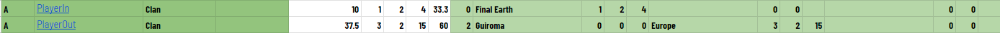
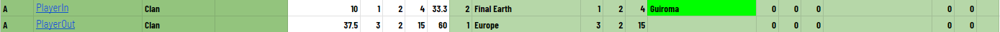
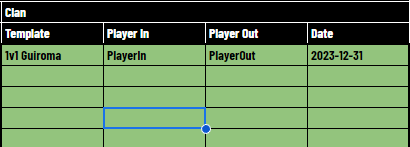
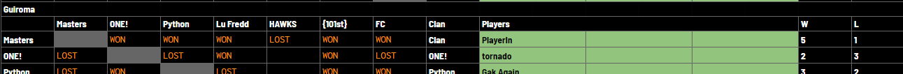
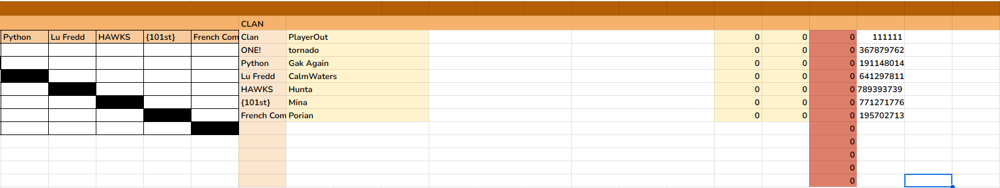
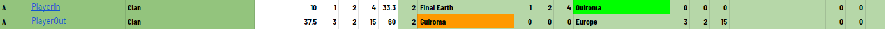
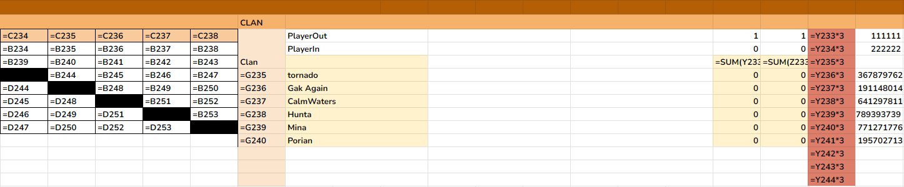
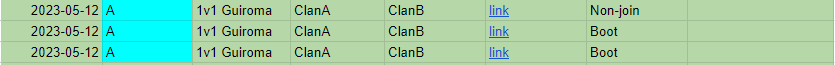
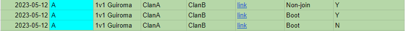
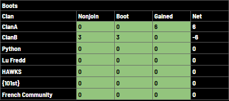

# Clan League Documentation

## Table of Contents

1. [Creating new Clan League Sheet](#creating-new-clan-league-sheet)
2. [Player substitutions](#player-substitutions)
3. [Boots & Non-joins](#boots--non-joins)
4. etc

## 1. Creating New Clan League Sheet

## 2. Player Substitutions

There are two cases to consider: (1) exitting player has not played a game on the template yet & (2) exitting player has been invited, is playing or has finished a game on the template.

**Player to sub in will be `PlayerIn` (Warzone ID: 222222) & the player to sub out will be `PlayerOut` (Warzone ID: 111111) & the template to sub will be `1v1 Guiroma`**

### (1) Player has not played on the template yet

This scenario usually happens before a template has began, but could also happen if a recently subbed in player is being subbed out before the next game is made.

1. On `Player_Stats` find the players to sub in/out (you can select the clan under `Conditional Highlighting` on the right of the table to change the colour for the clan -- Just reset the selected clan to `Clan List` after)

2. Remove the slot from `PlayerOut` (readjusting the remaining slots they have including the formula for calculating per-slot points) and copy the removed slot to `PlayerIn`. Change the template name for `PlayerIn` to green.

3. Add the substitution to the `Substitutions` tab.

4. Update the player name in the relevant `DATA_X` tab.

5. Find the relevant player under the `GLX` tab.

6. Overwrite the player name and warzone ID with `PlayerIn` (since there are no games for `PlayerOut`, no new lines are required).

### (2) Player has played on the template

1. (Same as previous section) On `Player_Stats` find the players to sub in/out (you can select the clan under `Conditional Highlighting` on the right of the table to change the colour for the clan -- Just reset the selected clan to `Clan List` after)

2. Change the template name to orange on `PlayerOut` and copy the removed slot to `PlayerIn`. Change the template name for `PlayerIn` to green.

3. (Same as previous section) Add the substitution to the `Substitutions` tab.

4. (Same as previous section) Update the player name in the relevant `DATA_X` tab.

5. (Same as previous section) Find the relevant player under the `GLX` tab.

6. Move all the clans below the substituting clan down lines to allow for the new player to be inserted (and a summing total row for the substituting clan if it does not exist already). Clan name formulas may need to be adjusted.

Add the `PlayerIn` along with their warzone ID. Change the clans players background (name & wins/losses) to `reset` and set the background colour for the `totals` row to yellow and update the `totals` wins/losses to `=SUM(range)` where `range` are the clans players.

## 3. Boots & Non-joins

**The winning clan will be `ClanA` and the losing clan will be `ClanB`**

1. Periodically look at the `Boots` table for new games to check. These can either be `non-joins` or `boots`. Non-joins are easy while boots require looking over the game to ensure the game was legitimately booted (not a boot that was after the game was really over).

2. Mark the last column as `Y` for legit boots/non-joins and `N` for boots that are trivial (ie. should not count as a boot).

3. Go to the relevant division `DATA_X` page and add the points for the game to the relevant column/clan. **The total `net` sum should be 0.**

