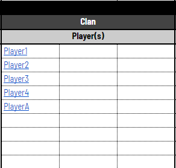
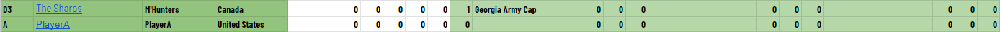
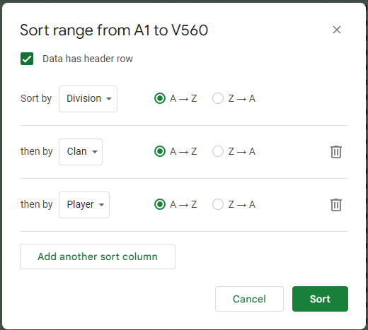
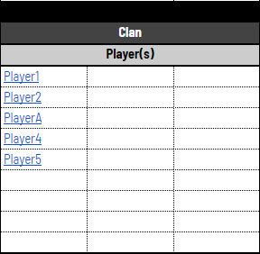
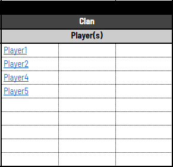
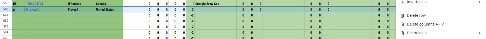

# Clan League Documentation

## Table of Contents

1. [Creating new Clan League Sheet](#1-creating-new-clan-league-sheet)
2. [Player substitutions](#2-player-substitutions)
3. [Boots & Non-joins](#3-boots--non-joins)
4. [Adding New Players During Midseason Registration](#4-adding-new-players-during-midseason-registration)
5. [Removing Existing Players During Midseason Registration](#5-removing-existing-players-during-midseason-registration)

## 1. Creating New Clan League Sheet

## 2. Player Substitutions

There are two cases to consider: (1) exitting player has not played a game on the template yet & (2) exitting player has been invited, is playing or has finished a game on the template.

**Player to sub in will be `PlayerIn` (Warzone ID: 222222) & the player to sub out will be `PlayerOut` (Warzone ID: 111111) & the template to sub will be `1v1 Guiroma`**

### (1) Player has not played on the template yet

This scenario usually happens before a template has began, but could also happen if a recently subbed in player is being subbed out before the next game is made.

1. On `Player_Stats` find the players to sub in/out (you can select the clan under `Conditional Highlighting` on the right of the table to change the colour for the clan -- Just reset the selected clan to `Clan List` after)

2. Remove the slot from `PlayerOut` (readjusting the remaining slots they have including the formula for calculating per-slot points) and copy the removed slot to `PlayerIn`. Change the template name for `PlayerIn` to green.

3. Add the substitution to the `Substitutions` tab.

**NOTE: the template name MUST be spelled the exact same way or else scripts will break.**

4. Update the player name in the relevant `DATA_X` tab.

5. Find the relevant player under the `GLX` tab.

6. Overwrite the player name and warzone ID with `PlayerIn` (since there are no games for `PlayerOut`, no new lines are required).

**Note: the `PlayerIn` name MUST match the spelling as in the `Player_Stats` page or else scripts will break. The ID must also match the order of players.**

### (2) Player has played on the template

1. (Same as previous section) On `Player_Stats` find the players to sub in/out (you can select the clan under `Conditional Highlighting` on the right of the table to change the colour for the clan -- Just reset the selected clan to `Clan List` after)

2. Change the template name to orange on `PlayerOut` and copy the removed slot to `PlayerIn`. Change the template name for `PlayerIn` to green.

3. (Same as previous section) Add the substitution to the `Substitutions` tab.

**NOTE: the template name MUST be spelled the exact same way or else scripts will break**

4. (Same as previous section) Update the player name in the relevant `DATA_X` tab.

5. (Same as previous section) Find the relevant player under the `GLX` tab.

6. Move all the clans below the substituting clan down lines to allow for the new player to be inserted (and a summing total row for the substituting clan if it does not exist already). Clan name formulas may need to be adjusted.

Add the `PlayerIn` along with their warzone ID. Change the clans players background (name & wins/losses) to `reset` and set the background colour for the `totals` row to yellow and update the `totals` wins/losses to `=SUM(range)` where `range` are the clans players.

**Note: the `PlayerIn` name MUST match the spelling as in the `Player_Stats` page or else scripts will break. The ID must also match the order of players.**

## 3. Boots & Non-joins

**The winning clan will be `ClanA` and the losing clan will be `ClanB`**

1. Periodically look at the `Boots` table for new games to check. These can either be `non-joins` or `boots`. Non-joins are easy while boots require looking over the game to ensure the game was legitimately booted (not a boot that was after the game was really over).

2. Mark the last column as `Y` for legit boots/non-joins and `N` for boots that are trivial (ie. should not count as a boot).

3. Go to the relevant division `DATA_X` page and add the points for the game to the relevant column/clan. **The total `net` sum should be 0.**

## 4. Adding New Players During Midseason Registration

**Let `PlayerA` be the new player to add to a clan's roster.**

1. Add the player name (ideally exactly how it is spelled on Warzone) on the `Rosters` page assuming the clan still has more slots (max 27 players currently). Make sure to link the cell to the players profile on warzone (using their unique warzone player ID and not their discord-esque ID).

2. On the `Player_Stats`, copy an existing player's row in the same clan and copy it to the bottom of the list of players. Update the player's name and link, country and template slots. Make sure that the name matches their warzone name (and roster name).

3. Highlight all of the columns & players in the table (including the header), and hit `Data -> Sort Range -> Advanced Range Sorting Options`. Check `Data has header row` and sort the following by: `Division -> Clan -> Player`. `Sort`.

## 5. Removing Existing Players During Midseason Registration

**NOTE: a player can only be removed from a roster iff the player has not appeared in the lineup at any time.**

1. Remove the player name from the `Rosteres` tab and readjust players so there are no empty holes in the list.

Before:

After:

2. On the `Player_Stats` tab, highlight the player row, right click and select `Delete Row`.

